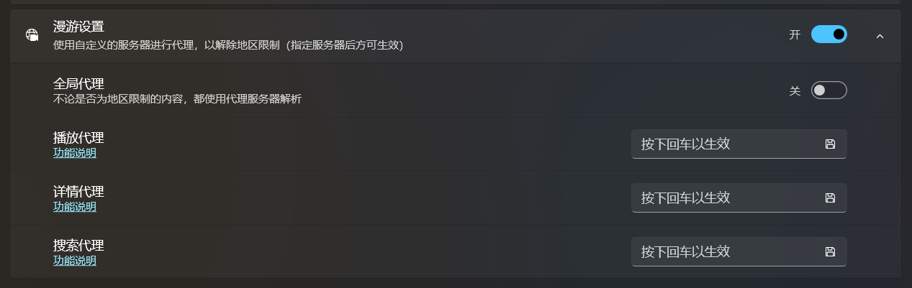

哔哩支持通过 BiliPlus 派生的网络服务来绕过地区限制，在内地播放港澳台专属的番剧或其它 PGC 内容。

但需要注意的是，哔哩本身是不能直接绕开地区检测的，这一过程发生在代理服务器中，哔哩会按照你的设置，先将请求发送到代理服务器，由代理服务器进行反向代理或其它操作，并将结果返回给应用。

应用向服务器发请求时是携带了你的用户令牌的（如果登录了的话），所以请务必选择一个自己信任的服务器，也正因为这一点：

***哔哩不提供默认的代理服务器，你需要自己选择，哔哩不对你的选择承担任何责任***

## 如何开启漫游

漫游功能默认关闭，如果要开启它，你需要进入设置页面：

刚开始，`漫游服务器地址` 这里是空白的，你必须输入正确的代理服务器地址才能使用漫游功能。

## 在哪里找代理服务器

哔哩所支持的漫游服务来自 [哔哩漫游](https://github.com/yujincheng08/BiliRoaming)，你可以在该仓库的 Wiki 中找到 [公共解析服务器](https://github.com/yujincheng08/BiliRoaming/wiki/%E5%85%AC%E5%85%B1%E8%A7%A3%E6%9E%90%E6%9C%8D%E5%8A%A1%E5%99%A8)，但对于有条件有能力的小伙伴，我还是建议 [自建解析服务器](https://github.com/yujincheng08/BiliRoaming/wiki/%E8%87%AA%E5%BB%BA%E8%A7%A3%E6%9E%90%E6%9C%8D%E5%8A%A1%E5%99%A8) 比较好。

## 何时需要代理

目前需要代理的主要有两个功能，一个是获取 PGC （包括动漫/电影/电视剧/纪录片等）内容详情，另一个是获取播放信息。所以对于有地区限制的视频，仅在这两个请求中使用代理，其它的请求都是直连到官方服务器。

## 什么是全局代理

默认情况下，哔哩会对标题上带有 `僅限港澳台` 字样的番剧调用代理，但这种判断逻辑比较粗暴，并不总能生效。所以如果你要看的番剧或其它 PGC 内容没有在标题上注明，但它又确实是有地区限制的，你可以开启全局代理，这样所有 PGC 详情请求和播放请求都会发送给代理服务器。

## 推荐的看番姿势

对于哔哩来说，用的主要是移动端的 API ，所以你直接搜地区限制番剧是搜不到的（又没给搜索服务上代理），而且 `哔哩哔哩番剧出差` 账户下的番剧直接点也大概率是看不了的。所以推荐的观看姿势是你先在能解除地区限制的设备上（比如你的手机，或者装了插件的网页）点个追番，之后你就可以在哔哩的 `我的收藏` 中找到该番剧，点击就可以看了。