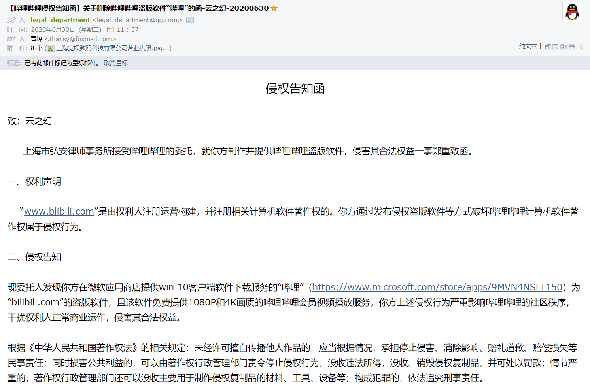

哔哩是一个第三方应用，而大多数第三方应用制作的初衷都是出于对官方应用某些现状的不满，哔哩也是。你觉得现在哔哩最优秀的地方，就是我当初对官方应用最不满的地方。

起初我并没有考虑过做这种第三方软件，毕竟 BiliBili 这种软件的体量是让个人开发者望而生畏的。直到我看到了 Github 上公开的 API 信息，看到了逍遥橙子的开源客户端，看到了 dribbble 上一些漂亮的客户端设计，再加上彼时刚做完 `开眼（Eyepetizer）` 的第三方实现，心痒之下，一头扎进了这个深坑。

## 回顾

初版的开发进度是很快的，即便我现在回过头看依然感到惊讶。从 `2020-4-9` 发布第一条动态开始，到 `2020-4-29` 发布介绍视频，短短20天就写完了一个第三方客户端，且基本功能齐备。在视频发布后的那几天是我过得最痛苦的几天，视频收获了大量的关注，收到了非常多的反馈，那几天的修复工作对我来说可以用 `疲于奔命` 这个词来形容，我不停地修复bug，追加新的功能，这样的日子持续了两个月，在我快被榨干的时候，贴心的阿B适时送上了律师函，于是 `2020-6-30` 开发中止。虽然那时颇感遗憾，但之后不久就借着累积的开发经验进了微软，得以在一个更好的平台进行更深入的学习，不能不说福祸难料。

> 需要解释的是，哔哩并没有如律师函所述免费提供 1080P 和 4K 画质的大会员服务，只是没有对非大会员隐藏这些视频自带的清晰度选项。非大会员用户即便选择了 4K ，最终的片源依然是非会员所能观看的最高清晰度。项目已开源，源码可查 [BiliBili-UWP](https://github.com/Richasy/BiliBili-UWP)

进入微软后，我参与了 Windows 11 的发布，并在其中做了一点小贡献。我其实很庆幸进入微软后依然能使用 UWP 开发应用，这个我大学自学的 "冷门" 框架给了我职业生涯最强有力的支持。在 WinUI 2.6 发布后，Fluent Design 迈入了下一个阶段，我认为是时候把自己以前做的应用重写了，哔哩就在此时再次进入了我的视野。

于是一年之后，`2021-5-30` 我创建了现在这个 [Bili.Uwp](https://github.com/Richasy/Bili.Uwp) 仓库，并提交了第一个 commit。

## 现状与困惑

哔哩是我的个人项目中受众最多的，也是影响最大的。我在开发过程中收到了大量的反馈，也意识到有很多人和我有着相同的需求，提出了很多让我感到兴奋的点子，这的确催着我不断地探索新功能，不断完善应用体验，不断追赶官方客户端的脚步。

但随着开发越来越深入，项目越来越复杂，我的无力感也逐渐增强，让我感到困惑的是，我的开发热情正迅速消退，这表示出了些问题，我需要停下来想想为什么。

分享是我最为重要的一个快乐源泉，但分享之所以快乐，在于能收到积极的反馈。发条朋友圈如石沉大海，连个点赞的人都没有，想必这种分享并不会让人快乐。

我借助 Github 平台提供的功能，以 Issue 作为反馈渠道，Discussions 作为论坛，寄希望于能形成一个积极的社区氛围，但很显然，目前来看是失败的。

软件出了问题，bug 反馈是很及时的。但是推出了新的功能，或者对问题进行了修复，却甚少见到讨论。以至于仓库有一条新的动态，十之八九都是报告问题，久而久之就有一种写代码就是在写bug的感觉。

这是最让我感到迷茫和困惑的地方，我相信其它的独立开发者或多或少也遇到过类似的情况：**开发时间越长，受众越多，收到的负反馈也越多，开发热情就消减得快。纵然大部分用户体谅第三方应用的功能不全，体验不佳，反馈问题时还不忘鼓励或安慰一句，但这并不能扭转这一趋势。最终开发者会逐渐失去信心和耐心，放弃对项目的维护，对于免费项目则更是如此**。

我作为开发者，直接对接用户，一些用户会对软件提出各种建议，反馈各种问题，希望应用按照他预想的方向转变，可若真变了，又会引起另外一些用户的不满。倘若为了平衡两者，添加新的行为，又往往背离自己的设计初衷，或者带来新的问题。

举例来说，WinUI 默认的媒体传输控件（播放器控制条）的背景是亚克力材质的，开发之处，我并没有修改这一行为。后来有人反馈说这种材质模糊背景，会遮挡字幕，建议改成旧版本的半透明背景。我在实际使用中也多次遇到这种问题，遂采纳了这一提议，改为了半透明。可这样一来，又有用户反馈半透明不好看，希望能改回原来的亚克力材质，或者添加一个设置项以允许用户自由切换这两种材质。但对我来说，为了一个控制器背景添加一个设置项显然有些小题大做了，我本能的不愿意这样做，于是现在控制器背景依然是半透明，而背景问题也依然有人在反馈。

看来不光政治是妥协的艺术，软件开发也是。

## 关于项目的未来

大家对哔哩是抱有期待的，我作为开发者更是如此。但我开发的那股子兴奋劲过去后又常常思考这个项目的未来是什么呢？

对于一个软件来说，它是要有立身之本的，也就是黑话里的 `护城河`、领域驱动设计里的 `核心子域`，否则这个软件即便火了，也会很快被取代。那么哔哩作为一个软件的核心子域又是什么呢？

我仔细思考之后，得出的结论是**没有**。

哔哩作为第三方应用，数据完全依赖于 BiliBili 官方；大部分人喜欢的 UI，也正在因为使用 WinUI 而变得通用，其他人不用费什么工夫就可以做一个和哔哩界面相仿的应用，只需要引用一个 nuget 包就可以；而诸如用户体验等，更是因人而异，不足为恃。

相反，即便现在官方应用 UI 不尽如人意，功能也不能说很完善（至少对比移动应用还差着一截），但可以得到充分的内部支持，且完全控制数据，还有网页作为缓冲，本身就立于不败之地。

倘若哔哩的目标是赶超官方应用——这的确是一部分人的期待——那么很遗憾，这是不可能的，也根本毫无意义。纵使费尽心力做出来了一个媲美移动端功能的桌面客户端又有什么用呢？我爱哔哩哔哩，所以我要给官方免费打工？

顺着这个思路，那么很容易想到，即便大家现在对哔哩青睐有加，但都是或有意或无意地在给官方应用施压，最终的目标都是希望官方应用能变得更好，一旦官方应用完成转型，不用人催，绝大部分现在的哔哩用户都会过渡到官方应用，即便我自己也不例外。

那么现在做的事情岂非毫无意义？哔哩这个项目还有必要继续存在吗？

现阶段是必要的，因为官方桌面客户端尚在转型中。但又不得不未雨绸缪，哔哩也需要走上一条新的道路。

新的道路是什么？我认为有两条，公私各一。

- 于私，哔哩对我来说是最好的试验田，我不是科班出身，编程纯靠自学。进微软后或主动或被动地学习了大量编程理论知识，哔哩这种体量的应用正可以让我实验种种架构、编程思想及设计模式。所以爬出用户体验这个无底深坑，重新回到编程本身，我就能从写代码中收获到足够的快乐，进入到学习——实践——理解——深入学习的模式之中，所得的产出能让哔哩作为一个优秀的应用开发样板回馈给开源社区，帮助后来者少走弯路。

- 于公，哔哩是一个终端，但要做开放的终端。开源并不是开放，打破信息茧房才是。信息茧房这个概念你不是第一次接触了，如果你还没有被驯化，那么你应该是对现状不满的。应用牢牢控制着内容，用户的社区最终成为了资本收割的工具，我相信我们终不会任由摆布的，我们永远渴望着信息的自由互通，我们永远希望能独立自主，而这份期待最终将成为哔哩的立足之本。

我不敢肯定哔哩能一直维护下去，但我确信即便哔哩消失了，还会有其它的我们称之为 `第三方` 的开发者们前赴后继，最终破除掉当下的信息茧房，发展出新的信息交流方式。