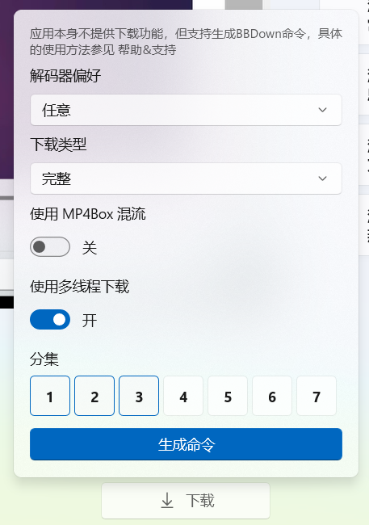

哔哩不提供下载功能，但通过与 BBDown 的合作，用户可以通过命令行工具下载自己感兴趣的视频。

> <small>哔哩对 BBDown 的引用已得到 BBDown 开发者的同意：[Issue: 希望可以引用BBDown作为Bili的下载工具](https://github.com/nilaoda/BBDown/issues/159)</small>

## 前置条件

1. 用户设备支持使用 PowerShell 或 CMD 等命令行工具。
2. 用户设备上需安装 ffmpeg 用来进行混流等操作。
3. 用户设备上应安装 [BBDown](https://github.com/nilaoda/BBDown) 用来进行下载。

关于 BBDown 的下载及安装步骤，请在 [BBDown](https://github.com/nilaoda/BBDown) 仓库中查看。

## 如何通过哔哩生成下载命令

1. 启动哔哩
2. 登录账户
3. 打开任意视频或番剧
4. 点击播放界面右下角的 **下载** 按钮，弹出下载配置面板
   
   
5. 你可以在这个界面中进行下载配置，选择指定编码的视频，或者仅下载音频等，你也可以选择下载哪几集视频。
6. 点击生成命令，下载命令会被放进你的剪切板中。
7. 打开 PowerShell 或 CMD ，粘贴之前的命令，按下回车即可下载。
   
   

## 关于视频存放位置

目前的行为是，你在哪里调用的命令，就下载在哪里，没有固定的存放地点。

*后续可能会更新*