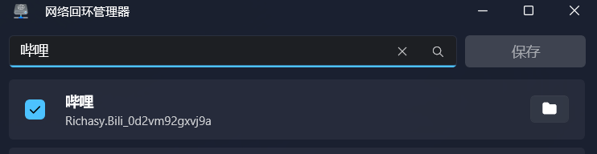

## 播放视频卡顿/掉帧

大概率是显卡的垂直同步设置问题，请根据自己的显卡型号选择合适的解决方法：

- Nvidia: [IT之家学院：UWP应用全屏播放视频掉帧或卡死解决方法](https://www.ithome.com/html/it/318382.htm)
- AMD: [Win10 UWP应用全屏播放卡顿掉帧的解决方法](https://bbs.pcbeta.com/viewthread-1830950-1-1.html)

## 视频无画面，仅有声音

此问题多出现于混合显卡的设备（即核显+独显），尝试在显卡设置中将哔哩设置为独显运行

## 网络正常的情况下，应用无法联网

### 使用了代理或VPN

~~关闭代理不就好了~~

通过侧加载或 Store 安装的 UWP 应用都禁用了本地网络环回。换句话说，网络流量不走本地代理。所以想解决翻墙情况下 UWP 应用无法联网的问题，只需启用本地网络环回即可。

1. 下载 [Windows Loopback Manager](https://github.com/Richasy/LoopbackManager/releases/tag/v0.0.1.0)，这个是项目 [tiagonmas/Windows-Loopback-Exemption-Manager](https://github.com/tiagonmas/Windows-Loopback-Exemption-Manager) 的打包版本。

2. 解压并启动其中的 *WindowsLoopbackManager.exe* 程序。

3. 搜索 **哔哩** 并勾选，点击 `Save` 即可。
   
    

### 未使用代理

如果你此时正在使用 Wifi，那么你应该是被隐藏设置坑了。

1. 打开 系统设置。
2. 打开 网络&Internet 设置。
3. 打开 [WLAN 设置](ms-settings:network-wifi)

如果你看到 `选择能使用你的 WLAN 数据的应用` 设置，那么请点进去，打开 `哔哩`，然后你就可以上网了。

*如果上述情景都不符合你的情况，请在 [哔哩论坛](https://github.com/Richasy/Bili.Uwp/discussions) 里发帖子咨询。*

## 怎么使用 H265/HEVC 播放视频 (AV1 同理)

需要在设备上安装HEVC解码器，由于Microsoft Store已经下架了免费版本，所以请自行搜索安装HEVC解码器。

你也可以选择热心网友提供的下载网站：[免费HEVC拓展](https://www.free-codecs.com/hevc_video_extension_download.htm)

*From [免费的HEVC #613](https://github.com/Richasy/Bili.Uwp/discussions/613)*

AV1 扩展下载：[Microsoft Store](https://www.microsoft.com/store/productId/9MVZQVXJBQ9V)

## 视频播放失败

这是个比较复杂的问题，但首先请检查下日志文件，通常错误信息会给出比较明确的提示，大多都与显卡有关。

1. 更新显卡驱动
2. 显卡降频（适用于以前超频了的显卡）
3. 显卡设置中的首选图形处理器选择 `自动`

在以上操作无效的情况下，可能是视频解码器缺失，请安装下述扩展：

- [MPEG-2 视频扩展](https://www.microsoft.com/store/productId/9N95Q1ZZPMH4)
- [VP9 视频扩展](https://www.microsoft.com/store/productId/9N4D0MSMP0PT)

或者自行搜索下载全套视频解码包

## 哔哩漫游的服务器无法在哔哩中使用

哔哩不支持哔哩漫游所使用的 API，详情参考 [[番剧代理]]

### 关联问题

- [无法播放视频，但是有声音](https://github.com/Richasy/Bili.Uwp/issues/171)
