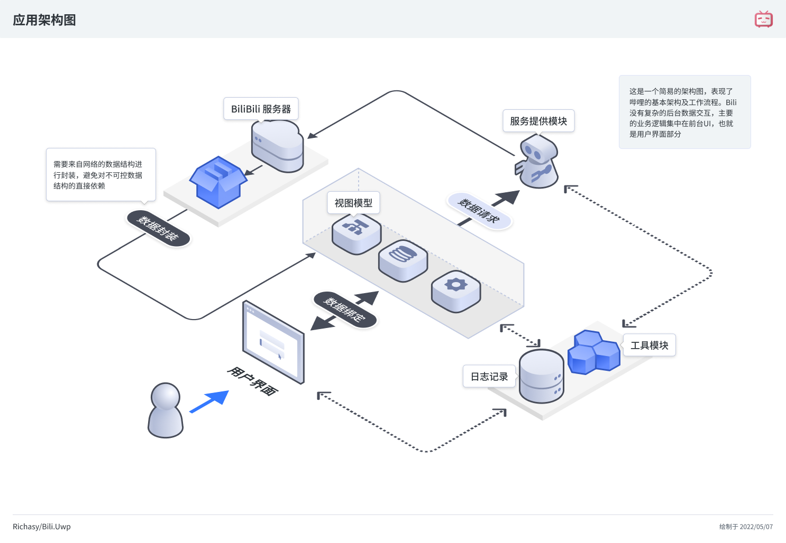

哔哩是一个有一点复杂的应用。从数据获取到内部模块的划分，再到用户界面上的具体表现，如何使之分工明确，井然有序且易于扩展，最关键的，还可以被测试。这对我来说的确是一个不小的挑战。

从整个应用的角度，我们依然遵循 MVVM 的设计指导思想，但是具体到各个组件，就可以实践多种设计模式了。

这是一张简单的架构设计思路图：

## 架构简述

新的架构使用了两种主要的设计思路：

- Dependency injection (依赖注入)
- Reactive programming (响应式编程)

新的架构采用完全的依赖注入，面向接口编程，不再依赖某个具体的实现。这一设计思路在视图模型层以下（数据层/服务层/工具）有效。再往上其实不是很有必要采取接口编程，到了 ViewModel 这一层，涉及到 UI，已经不太方便做单元测试。依赖注入照用，但是不会每一个视图模型对应一个接口了，在这一层，开始采取另一种设计思路：响应式编程。

这里的响应式编程使用了 [ReactiveUI](https://github.com/reactiveui/ReactiveUI) ，事实上，依赖注入的框架也是选的它的兄弟项目 [Splat](https://github.com/reactiveui/splat)，所以可以说 ReactiveUI 是保障新架构的最重要的类库。

响应式编程主要体现在视图模型层中，实际上，哔哩并没有做到真正的完全响应式编程，这对我来说还有一些难度，命令式的思维并不是那么容易转变的。

所以我更倾向于使用该库中一些简单的 API，比如 `ReactiveCommand` 来进行一些代码简化和复用，所以上手起来并不困难。

## 层级划分

尽管我想采用 DDD (领域驱动设计)，但显然这个要死太多的脑细胞，而且不见得花时间就有效果。所以我只能尽量分一些简单的层，配合依赖注入，让各层的耦合尽量减少，让数据的流动尽量明确。

### 数据层 (Model)

参见 [[数据模型]] 章节。

### 服务层 (Provider)

服务层就是做 API 的封装，在这一层中，会通过 API 请求网络数据 (json 或者其它数据)，并通过数据适配器 (Adapter) 转换为数据层中我们定义的数据结构，传递给下一层 (视图模型层) 使用。

### 视图模型层 (ViewModel)

视图模型层就开始对数据进行集中处理，按照功能进行划分，将服务层得到的信息转换为响应式的数据或命令，提供给 UI 进行显示。用户在 UI 上进行的交互也可以通过绑定传递给视图模型。

### 用户界面层 (View)

这一层直接和用户接触，它负责将视图模型层的数据变为用户可以感知的内容，比如图片、卡片或者视频等视觉元素。

用户在界面中做的操作，一方面以事件的方式在UI层内进行处理（比如面板的展开或折叠），另一方面则是通过命令绑定的形式，交由视图模型层进行数据处理（比如点击按钮收藏视频）。

### 工具 (Toolkit)

工具就不足以被称为一层了，它是数据处理工具，可以为各层提供支持。有些涉及到本机交互，有些是对现有 API 的封装。它被各个项目引用，本身并不与其它项目耦合。