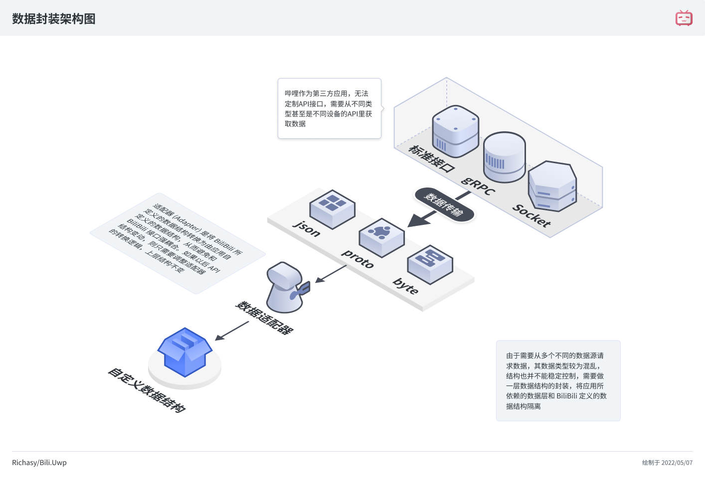

哔哩作为一个在线应用（要求用户联网才能使用），主要的数据模型可粗分为两类：

- 在线数据模型
- 本地数据模型

## 在线数据

哔哩是第三方应用，故绝大部分在线数据模型是根据官方服务器 API 所定义的数据结构转换而来。

哔哩的 API 分为三种：

1. HTTP Restful 式的标准接口
2. gRPC 的二进制接口
3. Web Socket 的套接字长连接

### 标准接口

标准接口的数据模型可以根据回传的 JSON 数据结构直接生成。但是生成的数据有三个问题，其一是不符合编程语言（C#）的命名规范（帕斯卡命名，首字母大写）；其二是直接依赖于接口定义，后期若有变动，修改起来非常麻烦，依赖性太强，会造成连锁反应；其三是部分属性的名称不易理解，且存在直接用数字做属性版本的情况。

所以对于这部分数据，引入 [Newtonsoft.Json](https://www.nuget.org/packages/Newtonsoft.Json) 做特性注解，做一层简单的封装，在应用内部重命名以降低对接口数据的直接依赖:

```csharp
[JsonObject(MemberSerialization = MemberSerialization.OptIn)]
public class PublisherInfo
{
    [JsonProperty(NullValueHandling = NullValueHandling.Ignore, PropertyName = "mid", Required = Required.Default)]
    public int Mid { get; set; }

    //...
}
```

标准接口的数据结构存放在 `src/Models/Models.BiliBili` 中。

### 二进制接口

哔哩哔哩现在开始使用 gRPC 来替代一部分高频使用的标准接口，二进制数据传输更有效率，也更节省带宽，速度也更快，缺点就是不如标准接口回传的 JSON 那样直观易读。这部分的数据已经通过 `.proto` 文件被预先定义，目前哔哩依赖 [SocialSisterYi/bilibili-API-collect](https://github.com/SocialSisterYi/bilibili-API-collect/tree/master/grpc_api) 中列举的 gRPC 接口文件，通过 [Grpc.Tools](https://www.nuget.org/packages/Grpc.Tools/) 在生成项目时自动生成对应的 C# 类型定义，这部分类型定义常规情况下不可见，且不可修改（会被下一次生成取代）。

gRPC 的定义文件存放在 `src/Models/Models.gRPC` 中。

### 套接字长连接

目前 Web Socket 仅应用在观看直播时，可以通过套接字发送心跳包、接收弹幕信息等。

套接字通常通过字节码来进行信息传输，在解析过程中还需要对字节特征码进行分析，尽管内部包含的是转换为字节流的 JSON 字符串，但传输的数据结构却并不固定，且数据中通常以数字代替文本表示。所以考虑到实际应用，我们还需要对数据进行二次转换，像标准接口那样预先定义类型并不方便，故直接通过节点查询的方式定向获取我们需要的信息，再将其组合为我们所定义的消息类型。

### 自定义数据结构

你可以发现，作为整个应用基石的在线数据结构完全依赖于哔哩哔哩的接口。尽管作为哔哩哔哩的第三方应用，我们的所有服务毋庸置疑都必须依赖哔哩哔哩，但从软件开发的角度来看，一个应用的底层数据结构完全依赖于一个不受控制的数据供应商，这样做就像是把万丈高楼建在沙子上。接口定义稍有变动，哔哩的整个应用逻辑就可能完全崩溃，导致应用不可用。

所以，我们不能将整个应用的业务逻辑所依赖的基础数据结构完全交给哔哩哔哩。我们应该创建一个受我们自身控制的数据层，然后在哔哩哔哩的数据结构与我们自己维护的数据结构间创建一个 `适配器 (Adapter)`。应用的其它层级或模块都不直接依赖于哔哩哔哩的数据结构，通过这种解耦，使得哔哩哔哩的数据结构变成**可替换的**，这样一来，接口变动时我们就可以通过仅修改适配器逻辑来快速跟进。

## 数据封装架构



## 本地数据

哔哩主要是一种信息展示应用，实际上，处理完前面的在线数据模型，本地的数据模型更多的是一种补充。

比如创建一些用于表示状态的枚举，或者创建一些 UI 需要的数据结构，它们本身并不复杂。

本地的数据结构主要放在 `src/Models` 中，包括 App, Enums，以及 Data 项目的 Local 文件夹下的内容.