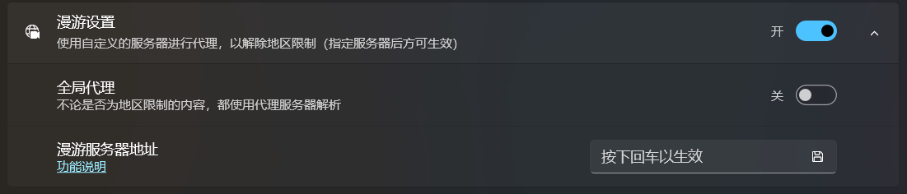

哔哩支持通过 BiliPlus 派生的网络服务来绕过地区限制，在内地播放港澳台专属的番剧或其它 PGC 内容。

但需要注意的是，哔哩本身是不能直接绕开地区检测的，这一过程发生在代理服务器中，哔哩会按照你的设置，先将请求发送到代理服务器，由代理服务器进行反向代理或其它操作，并将结果返回给应用。

应用向服务器发请求时是携带了你的用户令牌的（如果登录了的话），所以请务必选择一个自己信任的服务器，也正因为这一点：

***哔哩不提供默认的代理服务器，你需要自己选择，哔哩不对你的选择承担任何责任***

## 如何开启代理

代理功能默认关闭，如果要开启它，你需要进入设置页面：

刚开始，三个代理服务器地址都是空白的，你必须输入正确的代理服务器地址才能使用对应的代理功能。

## 在哪里找代理服务器

**[哔哩漫游](https://github.com/yujincheng08/BiliRoaming)** 的代理服务器不能直接应用在哔哩上，你需要根据 [[构建番剧代理服务]] 这篇文章手动创建自己的反向代理服务。

因为两者对请求 PGC 内容所使用的 API 完全不同，哔哩建立在现有的移动客户端 API 之上，由于与功能耦合（包括观看进度，社区信息、分集详情等），不会使用哔哩漫游所支持的API。

所以 **不要将哔哩漫游的服务地址写在哔哩的代理服务中**，也 **不要因为哔哩漫游的服务器不能在哔哩中工作而去找我或者哔哩漫游开发人员询问为什么不能工作，这会引起双方的矛盾**。

番剧代理不是一个面向大众的功能，如果你有一定的动手能力，并且有这种需求，那么你可以按照教程一步步来。如果在阿里云构建服务这听起来对你有些困难，请选择更普适更易用的方案。

## 何时需要代理

目前需要代理的主要有三个功能，一个是获取 PGC （包括动漫/电影/电视剧/纪录片等）内容详情，一个是获取播放信息，另一个是搜索番剧。所以对于有地区限制的视频，仅在这三个请求中使用代理，其它的请求都是直连到官方服务器。

## 全局代理

默认情况下，哔哩会对标题上带有 `僅限港澳台` 字样的番剧调用代理，但这种判断逻辑比较粗暴，并不总能生效。所以如果你要看的番剧或其它 PGC 内容没有在标题上注明，但它又确实是有地区限制的，你可以开启全局代理，这样所有 PGC 详情请求和播放请求都会发送给代理服务器。

## 详情代理

详情代理指的是番剧详情页，即通过 API `api.bilibili.com/pgc/view/v2/app/season` 获取的包括番剧介绍在内的信息，它是 [播放代理](#播放代理) 的前提，只有它请求成功才会去请求播放信息。

## 播放代理

播放代理指的是番剧播放信息，即通过 API `api.bilibili.com/pgc/player/web/playurl` 获取的流信息，目前 哔哩 仅支持 Dash，不再对 flv 提供支持，所以对应的服务器应满足这一需求。

## 搜索代理

搜索代理即服务器通过 API `app.bilibili.com/x/v2/search/type` 来获取搜索结果，有些服务会在搜索结果中掺杂其它信息，比如声明或警告，目前哔哩暂不屏蔽。

