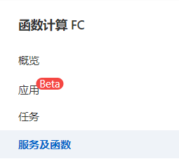
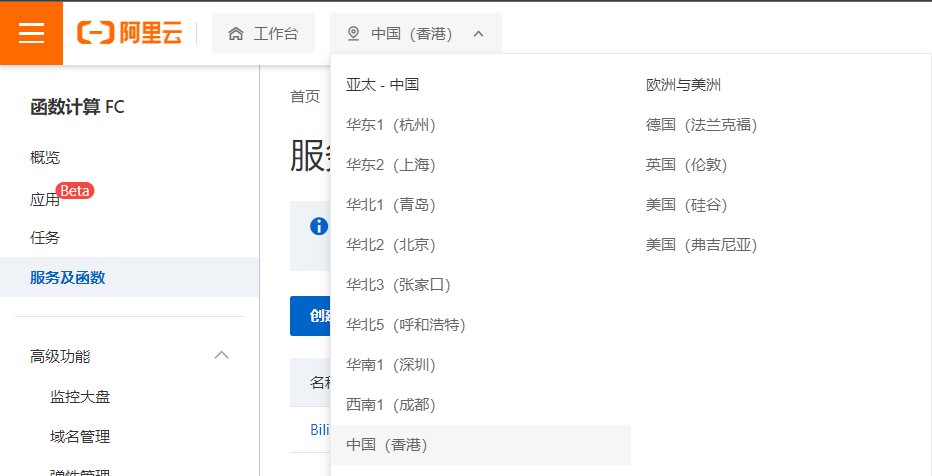
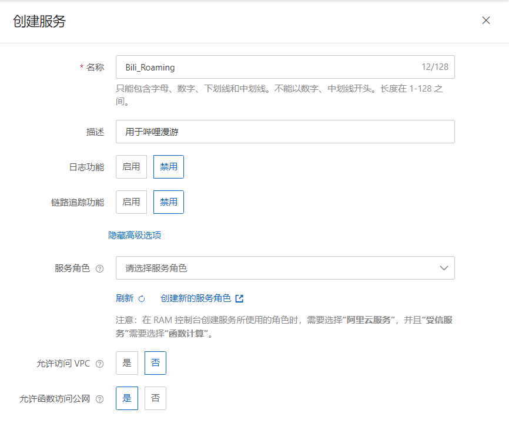
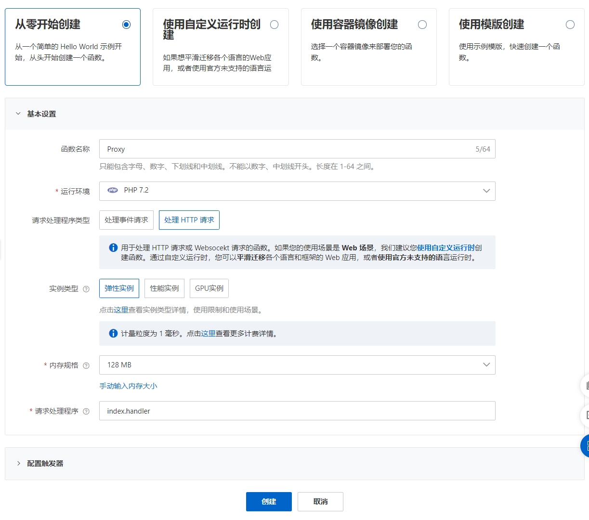
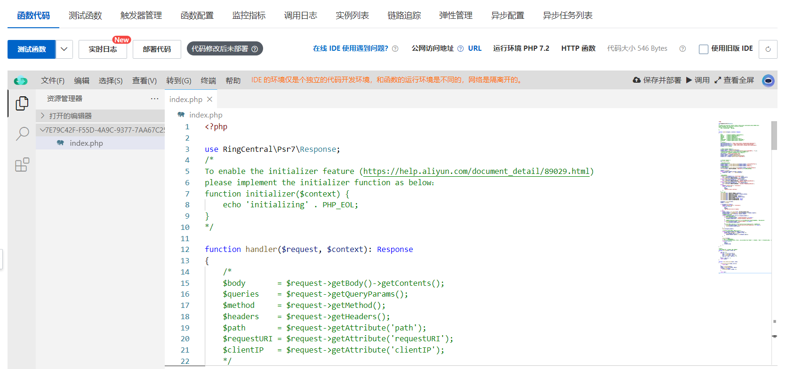
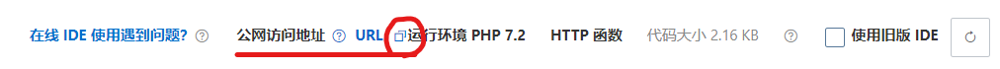
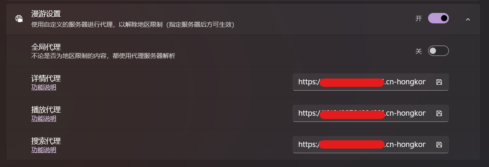

本文写于 2022/05/07，你阅读此文时，其内容可能已经变更或失效。

哔哩于 2.2205.0.0 支持了哔哩漫游的功能，但由于获取番剧详情的 API 和现有大部分服务不匹配，导致直接使用现有服务无法正常观看出差番剧。为了降低大家的心智负担，我参考 [阿里云函数部署简易教程](https://github.com/ipcjs/bilibili-helper/issues/710#issuecomment-748976481) 为大家提供一种简单的反向代理方式。每个人都可以使用这种方式，但相应的，代理服务最好只是自用，不要将自己的代理地址轻易分享给他人，以免给自己造成不必要的损失。

> 注：目前阿里云仅有香港服务器，所以特定于非香港地区的番剧需要另觅他法。

## 准备工作

1. 打开 [阿里云](https://cn.aliyun.com/) 并注册一个账户。
2. 登录后进入 [函数计算 FC](https://fcnext.console.aliyun.com/overview) 页面。

## 创建服务

1. 在侧边栏选中 `服务及函数` 

    

2. 将光标移到顶部导航栏，工作台按钮的右侧，切换当前区域为 `中国（香港）`

    

3. 切换后，点击下方蓝色的 `创建服务` 按钮，先创建一个计算服务

    

4. 创建成功后，在函数管理页面点击蓝色的 `创建函数` 按钮，创建我们需要运行的反向代理脚本

    由于只是自用，所以我们可以按最低配置来，选择 `弹性实例`，并将内存大小设置为最小的 `128MB`，其它的维持默认即可
    

5. 函数创建完毕，等待页面加载好，你能看到一个编辑器之后，点击编辑器左侧文件列表中的 `index.php`，并将 [[适用于哔哩的反代PHP脚本]] 里的 PHP 代码粘贴进 `index.php` 里，替换掉原有的内容.

    

6. 点击编辑器右上区域的 `部署` 按钮，等待函数部署完成

    

7. 部署完成后，此时你的脚本已经生效，可以通过公网网址进行访问了。点击顶部 `公网访问地址` 后的复制按钮，将你的函数地址复制下来

    

8. 打开哔哩，在设置中将上一步复制的网址粘贴到你需要的代理服务文本框中（如果你想，你可以全部写你的代理网址）

    